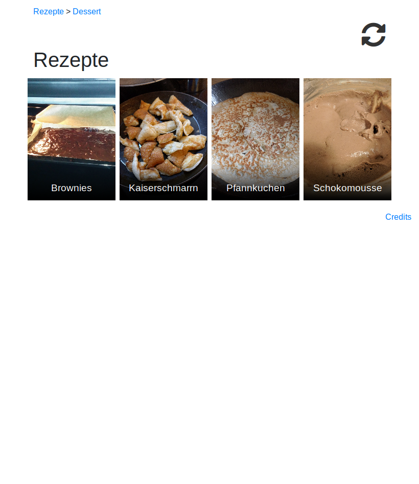
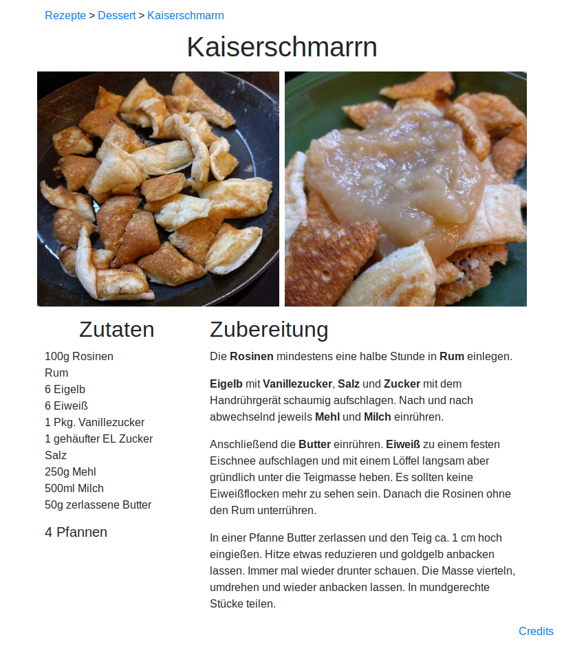

# What is this?
Just a small website based recipe collection for me and my girlfriend.

# How does it look?
Kategorie | Rezept
---|---
 | 

# How can I use it?
Clone/fork this rep.

```bash
npm install
npm run build:prod
```

Copy `recipes.tar.gz` to your server and extract it there. Run `npm run install:prod` on your server.

To start the server, you can use `npm run serve`.

# How can I add recipes?
Recipe
- Add &lt;name&gt;.json to a subfolder in recipes.
- It has to contain the following fields:
```json
{
    "name": "", // The name of your recipe
    "portions": "", // Optional
    "ingredients": [ //
        {
            "id": "", // Used for preparation. If a recipe with that id exists, it will automatically get linked
            "amount": "", // Optional
            "name": "" // Name of your ingredient
        },
        ...
    ],
    "preparation": ["", "", ...] // Steps to make your recipe
}
```
- It is possible to link ingredients in your preparation by using `{id}` in preparation. Example: You have an ingredient with `"id": "salt"`. Now you can use `{salt}` in preparation.

# Contribution

Feel free to give me a PR (or write me at Twitter: [@Sandr0x00](https://twitter.com/Sandr0x00)), if you got a nice recipe. I always try new stuff. I kind of think,someday I will be a better cook than programmer.

Currently, all recipes are written in german, but maybe someday, I or another one will translate them. If you want to be this "other one", tell me :)

# Author
[Sandro Bauer](https://twitter.com/Sandr0x00)